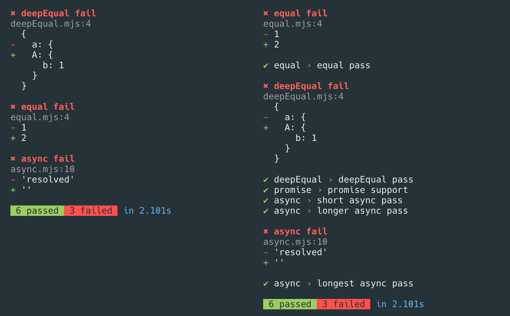

# ▶ oletus

[](https://travis-ci.org/bearror/oletus)

A zero configuration, zero dependency test runner for ECMAScript Modules—made specifically for getting started quick. Painless migration to the bigger guns if you end up needing them.

## Test Syntax

```js
import test from 'oletus'

// this should look pretty familiar
test('arrays are equal', t => {
  t.deepEqual([1, 2], [1, 2])
})
```

## Usage

### Add oletus to your project

Install it with npm:
```bash
npm install --save-dev oletus
```
Add the test script to your `package.json`, using the native [--experimental-modules](https://nodejs.org/api/esm.html#esm_ecmascript_modules):
```json
  "scripts": {
    "test": "npx -n='--experimental-modules --no-warnings' oletus"
  },
```
Alternatively, you can use the [esm](https://github.com/standard-things/esm#esm) package for wider support:
```json
  "scripts": {
    "test": "npx -n='-r esm' oletus"
  },
```

### Create the tests

Write your test modules in a `/test/` directory:
```js
import test from 'oletus'

test('foo', t => {
  t.ok(true)
})

test('bar', async t => {
  const bar = Promise.resolve('bar')

  t.equal(await bar, 'bar')
})
```

---

#### Alternate test locations

It's also possible to run tests that match a pattern passed in as a command-line argument.
```bash
oletus src/**/*.test.mjs
```

---

### `npm test` away!

## Reporters

Oletus has a *concise reporter* on local runs and a *verbose reporter* on CI environments.




## API

### `test(title, implementation)`
The imported `test` is an *async function* that expects the `title` and `implementation` of the test to be passed in as arguments. The implementation has a single parameter (`t`, for example) that gets passed the [strict node assertion](https://nodejs.org/api/assert.html#assert_strict_mode) module.

## Author

Joonatan Vuorinen ([@bearror](https://twitter.com/bearror))
